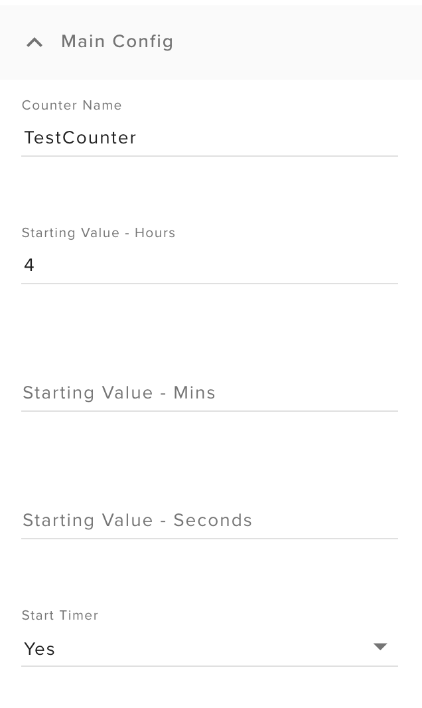
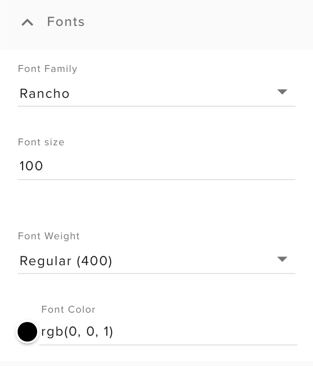
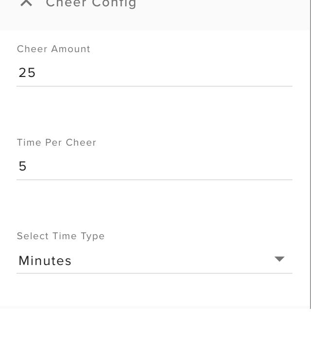
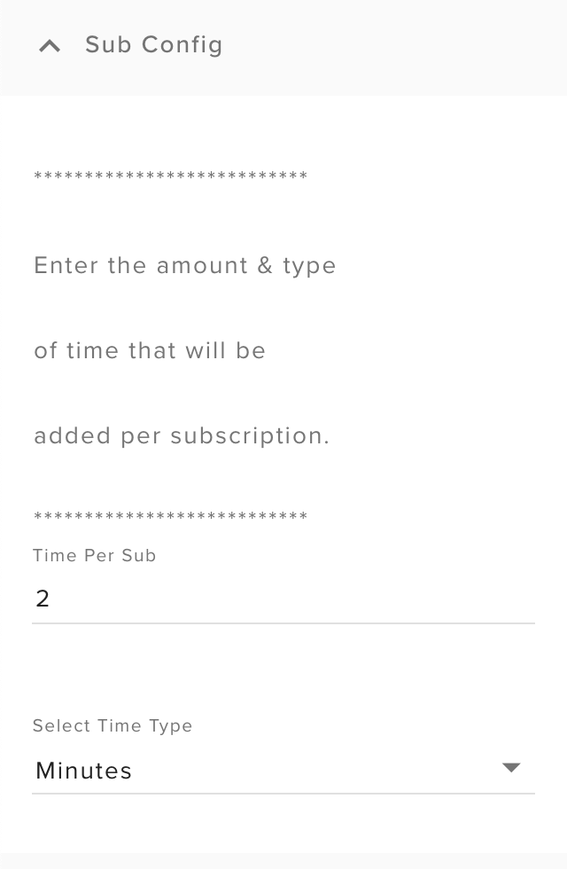
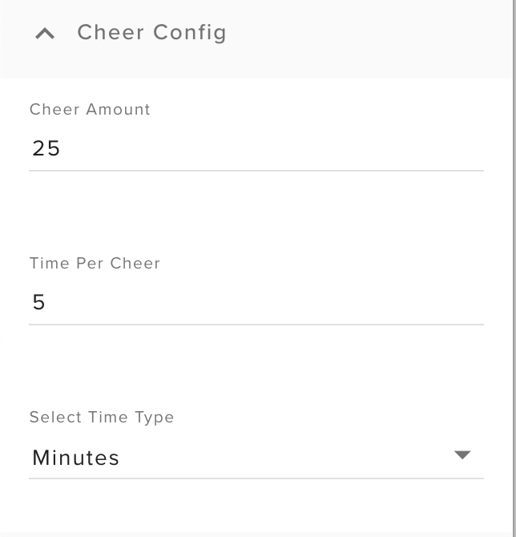
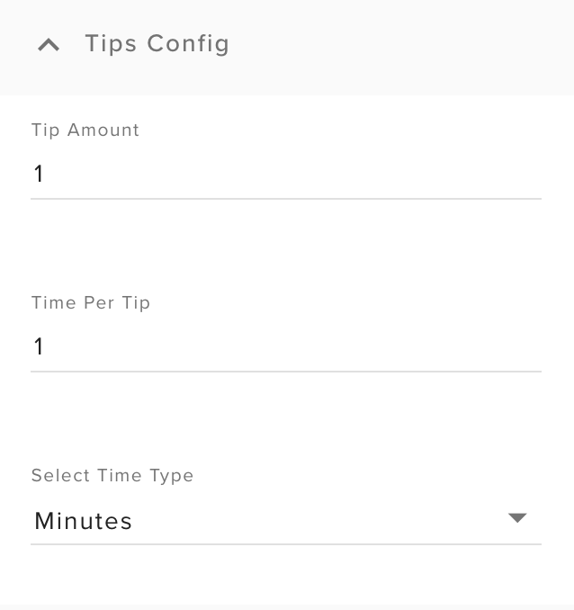
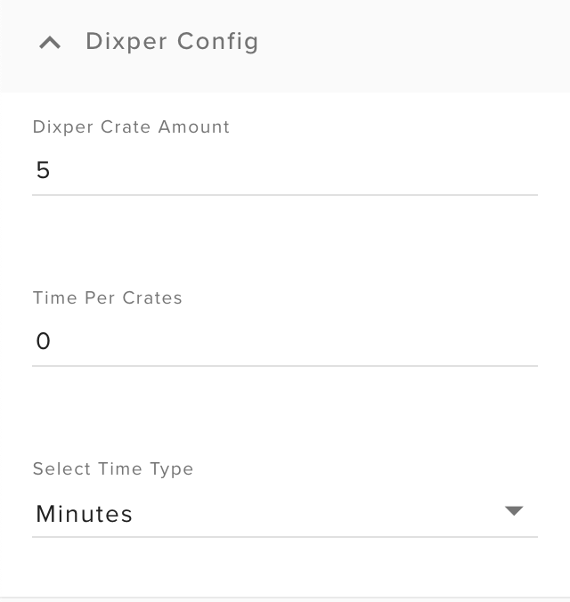

# Marathon Stream Timer Stream Elements Overlay

1.) Go to your Stream Elements dashboard & create a new blank overlay in My Overlays.

2.) Leave the overlay resolution set to 1080p & click start

3.) Add a custom widget.

4.) Click the Open Editor button on the left.

5.) When the editor opens, remove all the code from each tab (HTML, CSS, JS, Fields, & Data).

6.) Here, on Github, click the name of the file that you want to copy.

7.) When the file view loads, click the Raw button & then copy the raw code displayed on the page.

8.) Paste the code in the respective tab back in the Stream Elements editor.

9.) Repeat steps 6 - 8 for each tab & its corresponding file. There will not be a file for the Data tab.

10.) Once this is complete, click Done on the Stream Elements editor & you should now see a new custom built Marathon Stream Timer. 

You should also have all of your setup options on the left.

# How to use your Marathon Timer

The marathon timer is an overlay for streamers who want to display an interactive count down timer on their stream. These are usually used for longer, marathon type streams where the community can Sub, Cheer, Tip, etc to run the clock up for how long the streamer will continue to stream.

The following will explain how to configure the timer.

**Main Config**

The main config section is for the base timer configuration.

- Timer Name 

The timer name is required and is used to keep the time in sync if the timer source has to be reset for any reason.

- Starting Values: Hours, Minutes, Seconds

Enter the amount of time that you will want the clock to start at.

- Start Timer

Choose yes to start the timer & no to stop it.

**Fonts**

The fonts section is used to select & customize your font.

- Font Family 

Select a font from a drop down of all the available Google fonts.

- Font Size

The size of your timer's font.

- Font Weight

Select the boldness of your font.

- Font Color

Select the color of your font.

**Chat Commands**

The chat commands section allows you to setup a custom chat command to manually add time to the timer.  Only the streamer can use the command.

- Add time command 

Enter the command that you would like to use to add time.

Use the following format to add time to the timer: *!YourCommand Amount(Type) -- !YourCommand 10m will add 10 minutes.*

Your time types are hours(h), minutes(m) & seconds(s).

**Sub Config**

The sub config section is for configuring how much time is added to the clock per subscription event.

- Time Per Sub

The amount of time to be added per sub.

- Select Time Type

The type of time in which the amount should be added, hours, minutes or seconds.

**Cheer Config**

The cheer config section is for configuring how much time is added to the clock per an amount of bits cheered.

The best way to read & understand the config is top down. In the screen shot below the configuration would read as follows:

*For every 25 bits cheered, 5 minutes will be added to the clock.*

Therefore if someone cheers 50 bits, it will add 10 minutes to the clock.

- Cheer Amount

The amount a visitor must cheer to add time to the clock

- Time Per Cheer

The amount of time to be added per cheer amount.

- Select Time Type

The type of time in which the amount should be added, hours, minutes or seconds.

**Tips Config**

The tips config section is for configuring how much time is added to the clock per an amount tipped.

The best way to read & understand the config is top down. In the screen shot below the configuration would read as follows:

*For every 1 dollar tipped, 1 minute will be added to the clock.*

Therefore if someone tips $5, 5 minutes will be added to the clock.

- Tip Amount

The amount a visitor must tip to add time to the clock

- Time Per Cheer

The amount of time to be added per tip amount.

- Select Time Type

The type of time in which the amount should be added, hours, minutes or seconds.

**Dixper Config**

The Dixper config section is for configuring how much time is added to the clock per an amount of Dixper crates purchased.

This integration requires you to be a [Dixper](https://dixper.gg/home) user & to have the Dixper bot enabled in your chat.

Remember, the best way to read & understand the config is top down. 

- Dixper Crate Amount

The amount of Dixper crates a visitor must purchase to add time to the clock.

- Time Per Crates

The amount of time to be added per crates purchased.

- Select Time Type

The type of time in which the amount should be added, hours, minutes or seconds.

# Change Log

