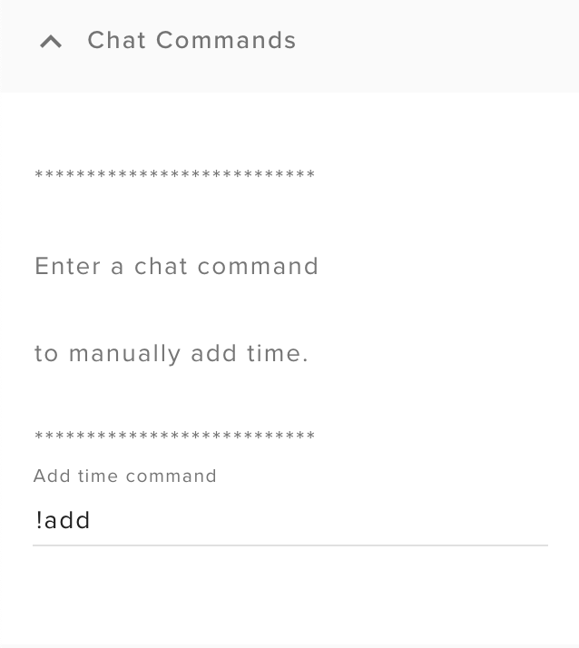

# Marathon Stream Timer Stream Elements Overlay

1.) Go to your Stream Elements dashboard & create a new blank overlay in My Overlays.

2.) Leave the overlay resolution set to 1080p & click start

3.) Add a custom widget.

4.) Click the Open Editor button on the left.

5.) When the editor opens, remove all the code from each tab (HTML, CSS, JS, Fields, & Data).

6.) Here, on Github, click the name of the file that you want to copy.

7.) When the file view loads, click the Raw button & then copy the raw code displayed on the page.

8.) Paste the code in the respective tab back in the Stream Elements editor.

9.) Repeat steps 6 - 8 for each tab & its corresponding file. There will not be a file for the Data tab.

10.) Once this is complete, click Done on the Stream Elements editor & you should now see a new custom built Marathon Stream Timer. 

You should also have all of your setup options on the left.

# How to use your Marathon Timer

The marathon timer is an overlay for streamers who want to display an interactive count down timer on their stream. These are usually used for longer, marathon type streams where the community can Sub, Cheer, Tip, etc to run the clock up for how long the streamer will continue to stream.

The following will explain how to configure the timer.

** Main Config **

The main config section is for the base timer configuration.

- Timer Name 

The timer name is required and is used to keep the time in sync if the timer source has to be reset for any reason.

- Starting Values: Hours, Minutes, Seconds

Enter the amount of time that you will want the clock to start at.

- Start Timer

Choose yes to start the timer & no to stop it.

** Fonts **

The main config section is for the base timer configuration.

- Timer Name 

The timer name is required and is used to keep the time in sync if the timer source has to be reset for any reason.

- Starting Values: Hours, Minutes, Seconds

Enter the amount of time that you will want the clock to start at.

- Start Timer

Choose yes to start the timer & no to stop it.

** Chat Commands **

The main config section is for the base timer configuration.

- Timer Name 

The timer name is required and is used to keep the time in sync if the timer source has to be reset for any reason.

- Starting Values: Hours, Minutes, Seconds

Enter the amount of time that you will want the clock to start at.

- Start Timer

Choose yes to start the timer & no to stop it.

** Sub Config **

The main config section is for the base timer configuration.

- Timer Name 

The timer name is required and is used to keep the time in sync if the timer source has to be reset for any reason.

- Starting Values: Hours, Minutes, Seconds

Enter the amount of time that you will want the clock to start at.

- Start Timer

Choose yes to start the timer & no to stop it.

** Cheer Config **

The main config section is for the base timer configuration.

- Timer Name 

The timer name is required and is used to keep the time in sync if the timer source has to be reset for any reason.

- Starting Values: Hours, Minutes, Seconds

Enter the amount of time that you will want the clock to start at.

- Start Timer

Choose yes to start the timer & no to stop it.

** Tips Config **

The main config section is for the base timer configuration.

- Timer Name 

The timer name is required and is used to keep the time in sync if the timer source has to be reset for any reason.

- Starting Values: Hours, Minutes, Seconds

Enter the amount of time that you will want the clock to start at.

- Start Timer

Choose yes to start the timer & no to stop it.

** Dixper Config **

The main config section is for the base timer configuration.

- Timer Name 

The timer name is required and is used to keep the time in sync if the timer source has to be reset for any reason.

- Starting Values: Hours, Minutes, Seconds

Enter the amount of time that you will want the clock to start at.

- Start Timer

Choose yes to start the timer & no to stop it.

# Change Log

